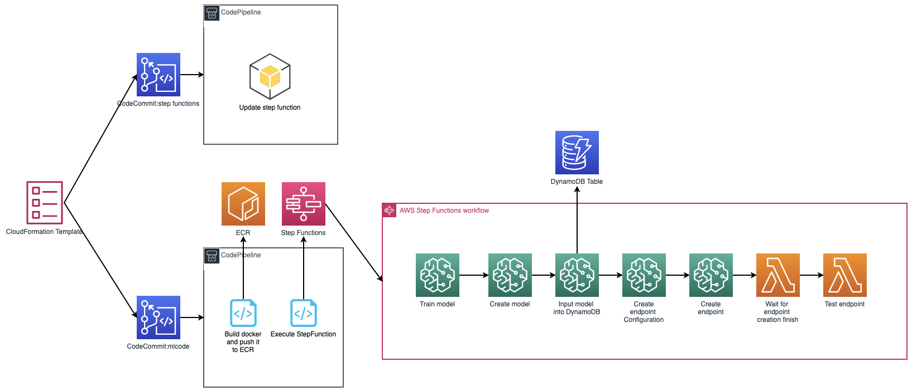
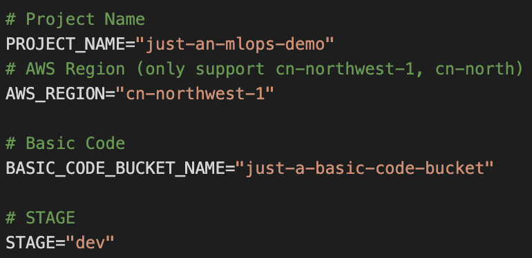

## MLOps template in China region

This content is an MLOps template based on SageMaker, Step Function and CodePipeline for China Region.

After deploying this template, you will create two CodePipelines, one is for updating StepFunctions, and the other is for automatically packaging code into ECR, training, and deploying the model as a SageMaker endpoint.

Primary technologies: SageMaker, StepFunctions, CodePipeline, Lambda, CloudFormation.

## Architecture

1. CodeCommit (StepFunctions + Code)
2. CodePipeline 1 : Update StepFunctions
3. CodePipeline 2 : Update code in ECR, retrain, deploy endpoint

## Automation and scale

There will be two steps to create the whole stack:

Step 1: Running`./build_zip.sh` to prepare all needed file;

Step 2: Editing the .env file, setting PROJECT_NAME, AWS_REGION, BASIC_CODE_BUCKET_NAME, STAGE;

Step 3: Executing prepare_env.sh, which will create bucket for creating CloudFormation, initializing CodeCommit repos, updating example dataset according to .env file;

Step 4: Executing deploy_cloudformation.sh, which will create IAM Roles CodeCommit repos, Code Pipelines, S3 Buckets, StepFunction workflow, and Lambda Functions.

After these steps, you will be able to change the ml pipeline by changing code in the CodeCommit repos.

## Security

See [CONTRIBUTING](CONTRIBUTING.md#security-issue-notifications) for more information.

## License

This library is licensed under the MIT-0 License. See the LICENSE file.